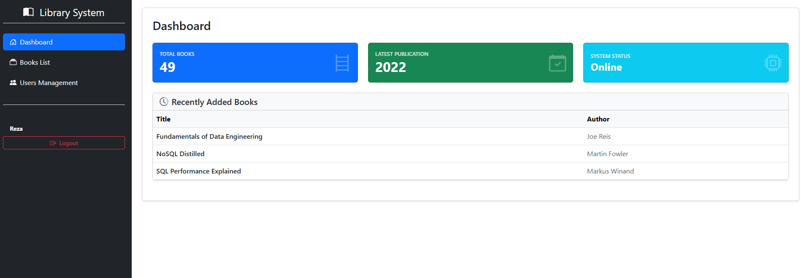
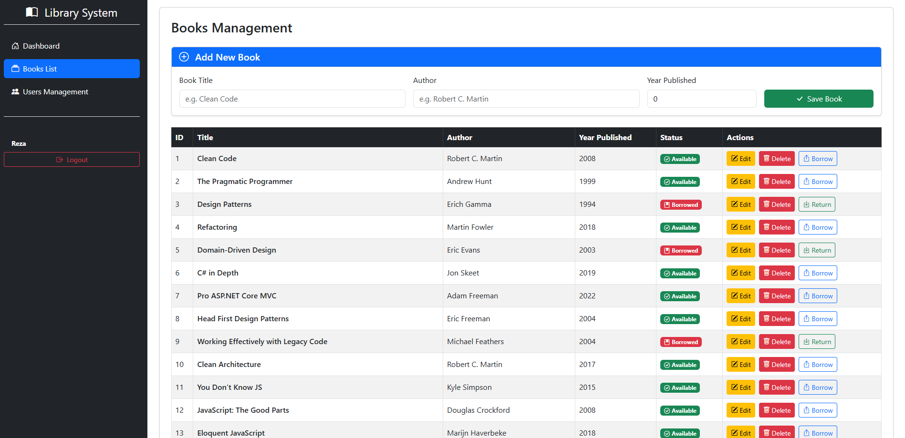
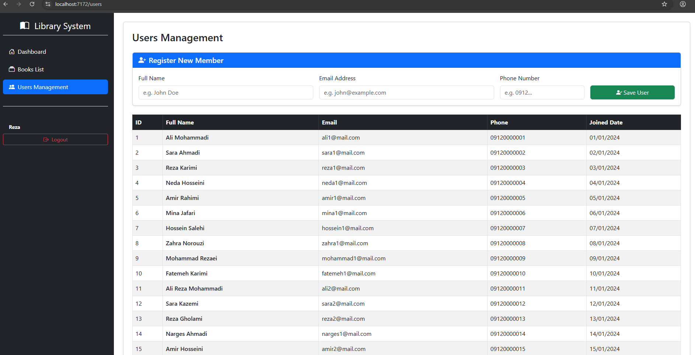

# Library Management System

A minimalist, full-stack web application built using the **KISS (Keep It Simple, Stupid)** principle. This system manages library operations including user registration, authentication, books directory, and borrowing logs, utilizing **ASP.NET Core MVC/Web API** for the backend and **Blazor WebAssembly** for the frontend client.

---

## Key Features

- Secure Authentication & Registration using ASP.NET `PasswordHasher`
- Reactive client-side route protection in Blazor WASM
- Dynamic navigation based on authentication state
- Full CRUD for books and users
- Lightweight API-first architecture

---

## System Screenshots

**Dashboard**


**Book List**


**User Management**


---

## Domain Entities

### User
Represents a library member or system operator.

- Id
- FullName
- Email
- PhoneNumber
- Password (hashed)
- MembershipDate

### Book
Represents a library book in the catalog.

- Id
- Title
- Author
- YearPublished
- IsAvailable

---

## System Architecture

### Backend (ASP.NET Core Web API)

- User registration with password hashing
- Login validation using `PasswordHasher`
- Simple REST endpoints without DTO overhead (prototype-friendly)

### Frontend (Blazor WebAssembly)

- `/login` authentication page
- `/dashboard` user landing page
- `/books` book management
- `/users` user management

State managed via browser local storage.

---

## Technology Stack

- ASP.NET Core 8/9 Web API
- Entity Framework Core
- Blazor WebAssembly
- Bootstrap 5

---

## Getting Started

### 1. Clone repository
```bash
git clone <repo-url>
